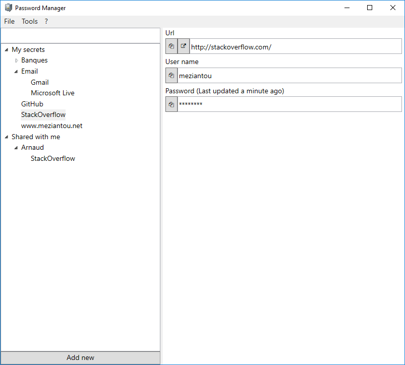
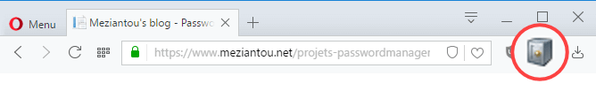

# Password Manager

`Password Manager` allows to store its passwords in a centralized and secure way. Indeed the passwords are encrypted on the client workstation
with the current standards (see details below). Thus, the web service never has clear passwords in its possession, and has no way to decipher them.



## Google Chrome / Opera / Vivaldi extension

The extension for browsers based on Chromium (Google Chrome, Opera, Vivaldi) automatically fills the form of the current page.

1. [Download extension](https://github.com/meziantou/PasswordManager/releases/tag/v1.0)
1. Extract the archive
1. Open the page: `chrome://extensions`
1. Click on the button `Developper mode`
1. Click on the button `Load unpacked extension...` and select the folder containing the extension

The icon appears to the right of the address bar. Click on it to open PasswordManager.



## Bookmarklet

It is possible to replace the extension with a bookmarklet. To do this, create a bookmark with the following url:

````
javascript:document.location = "meziantoupasswordmanager:search?url="+ encodeURIComponent(document.location.href)
````

## Security

1. Upon creation of the user account, a bi-key (RSA) is generated on the client computer
1. The private key is encrypted with the master key
1. When creating a password, it is encrypted with a unique generated 256-bit AES key
1. The AES key is encrypted with the public key of the user

=> All encryption operations are performed on the client computer (not on the server). Moreover, the web service never has the private key in its possession and therefore can not decipher the passwords.

## Sharing of passwords

It is possible to share an entry with another user of the service:

1. The AES key of the password is decrypted with the private key
1. The application retrieves the public key of the user with whom the password is shared
   and encrypts the AES key using it
1. The encrypted key is sent to the service

## Clipboard

The sensitive information copied to the clipboard are automatically deleted after a few seconds. Thus, sensitive data does not stay in the memory.
